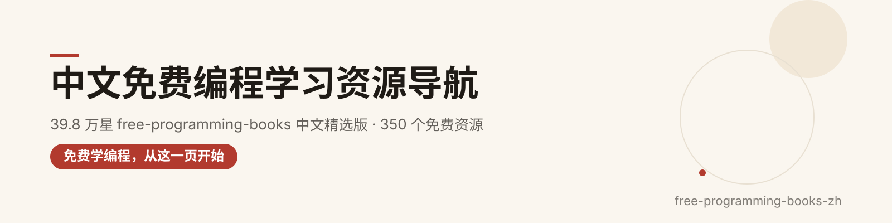
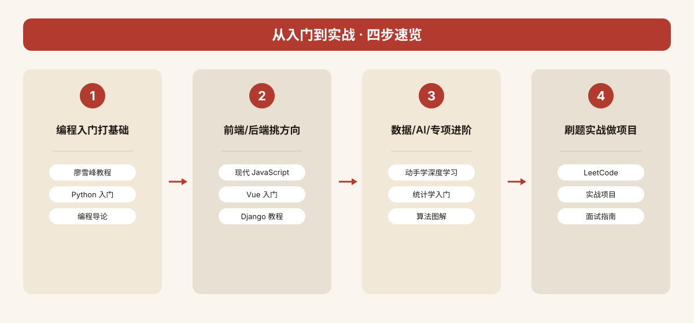

  

<h1 align="center">free-programming-books-zh</h1>

> **39.8 万 star 的「免费编程书圣经」，终于有中文精选版了。**
>
> 从 GitHub 顶流仓库 [EbookFoundation/free-programming-books](https://github.com/EbookFoundation/free-programming-books)（CC-BY-4.0，39.8 万 star）的海量清单中，精选 **350 个中文学习者真正用得上的免费资源**：免费书、教程、课程、交互式练习、速查表、播客…… 全部免费，全部可核验，按 22 个分类整理，中文一目了然。

---

## ✨ 为什么值得收藏

- **350 个精选资源 / 22 个分类**：从原仓库数千条清单里筛出精华，删掉重复与失效，剩下都是能用的；
- **中文优先**：单独设「中文原生资源」分类，国内作者/社区出品的免费好书一次收齐；英文经典也给了中文译名；
- **字段齐全**：中文名称 + 一句话说明 + 类型（书/教程/课程/速查表…）+ 语言 + 免费标识 + 官网链接；
- **零门槛**：原项目只收录免费资源，本仓库沿用同一标准，全部 ✅ 免费，直接打开就能学；
- **信息真实**：每条链接原样取自原仓库清单，可回溯、可核验，无占位符。

---

## 🗂 分类总览

| # | 分类 | 条数 | # | 分类 | 条数 |
| --- | --- | --- | --- | --- | --- |
| 1. 编程入门 | 12 | 12. 软件工程与设计 | 18 |
| 2. 前端开发 | 18 | 13. 系统设计与分布式 | 12 |
| 3. 后端开发 | 18 | 14. 安全与渗透 | 14 |
| 4. 数据科学与大数据 | 14 | 15. 游戏开发与图形学 | 14 |
| 5. AI与机器学习 | 16 | 16. 工具与效率 | 16 |
| 6. 移动开发 | 14 | 17. 数学与理论 | 12 |
| 7. 运维与DevOps | 18 | 18. 免费课程 | 20 |
| 8. 计算机基础 | 16 | 19. 交互式学习与练习 | 16 |
| 9. 数据库 | 14 | 20. 播客与视频 | 7 |
| 10. 算法与数据结构 | 16 | 21. 速查表 | 14 |
| 11. 编程语言专精 | 20 | 22. 中文原生资源 | 31 |

| **合计** | **22 个分类** | **350 个精选资源** |  |  |  |

  

---

## 🚀 新手四步走

  

> ① 编程入门打基础 → ② 前端 / 后端挑方向 → ③ 数据 / AI / 专项进阶 → ④ 刷题实战做项目。每个分类文件都能当书架用，按编号往下走即可。

---

## 📖 字段说明

- **类型**：书籍 / 教程 / 文档 / 课程 / 交互式 / 练习 / 速查表 / 播客 / 视频 / 合集；
- **语言**：中文（国内出品或官方中译）/ 英文 / 中英（双语对照）；
- **免费**：统一 ✅ 免费——原项目只收录免费资源，本仓库沿用同一标准；
- **链接**：原样取自原仓库清单，个别页面可能年久失效，失效欢迎提 Issue。

---

# 分类正文

## 1. 编程入门（12 个）
> 从零开始的编程学习路径，精选入门教材与平台。

| 中文名称 | 一句话说明 | 类型 | 语言 | 免费 | 链接 |
| --- | --- | --- | --- | --- | --- |
| 慕课网 | 国内知名编程实战课程平台，涵盖多方向入门课 | 课程 | 中文 | ✅ 免费 | http://www.imooc.com/course/list |
| 计蒜客 | 在线编程学习平台，提供系统化入门教程与练习 | 课程 | 中文 | ✅ 免费 | http://www.jisuanke.com |
| X 分钟学编程语言（Learn X in Y minutes） | 数十种编程语言的速览式入门教程 | 教程 | 中英 | ✅ 免费 | https://learnxinyminutes.com |
| Coursera 中文课程 | 国际名校公开课平台，含大量计算机科学课程 | 课程 | 中英 | ✅ 免费 | https://www.coursera.org/courses?orderby=upcoming&lngs=zh |
| 从零造轮子（Build Your Own X） | 汇集从零实现数据库、操作系统、编译器等项目的教程合集 | 合集 | 英文 | ✅ 免费 | https://github.com/codecrafters-io/build-your-own-x |
| Goalkicker 编程笔记 | 各编程语言的专业开发者笔记合集，即查即用 | 书籍 | 英文 | ✅ 免费 | https://goalkicker.com |
| 我们爱的论文（Papers We Love） | 计算机领域经典论文中文导读与收藏仓库 | 合集 | 英文 | ✅ 免费 | https://github.com/papers-we-love/papers-we-love |
| 组合程序（Composing Programs） | 基于 SICP 的 Python 编程入门经典教材 | 书籍 | 英文 | ✅ 免费 | https://composingprograms.com/3ed/ |
| 计算机程序的构造和解释（SICP） | MIT 经典计算机科学教材，深入理解编程本质 | 书籍 | 英文 | ✅ 免费 | https://sarabander.github.io/sicp/html/index.xhtml |
| 代码本色（The Nature of Code） | 用编程模拟自然系统，融合创意编码与物理算法 | 书籍 | 英文 | ✅ 免费 | https://natureofcode.com/book |
| 思考复杂性（Think Complexity） | 探索复杂系统与 Python 建模的入门书籍 | 书籍 | 英文 | ✅ 免费 | https://greenteapress.com/wp/think-complexity-2e/ |
| 计算机科学导论（OpenStax） | 开源计算机科学入门教材，适合零基础学习者 | 书籍 | 英文 | ✅ 免费 | https://openstax.org/details/books/introduction-computer-science |

## 2. 前端开发（18 个）
> 从 HTML/CSS 到 JavaScript 框架，前端工程师必备资源。

| 中文名称 | 一句话说明 | 类型 | 语言 | 免费 | 链接 |
| --- | --- | --- | --- | --- | --- |
| Chrome 开发者工具中文手册 | Chrome DevTools 完整中文翻译手册，调试必备 | 文档 | 中文 | ✅ 免费 | https://github.com/CN-Chrome-DevTools/CN-Chrome-DevTools |
| HTTP 接口设计指北 | RESTful API 设计最佳实践与风格指南 | 教程 | 中文 | ✅ 免费 | https://github.com/bolasblack/http-api-guide |
| Gulp 入门指南 | 前端构建工具 Gulp 的中文入门教程 | 教程 | 中文 | ✅ 免费 | https://github.com/nimojs/gulp-book |
| 全栈增长工程师指南（Growth） | 前端到全栈的成长路线与实战指南 | 书籍 | 中文 | ✅ 免费 | https://github.com/phodal/growth-ebook |
| 学习 CSS 布局 | 交互式 CSS 布局教程，Flexbox 与 Grid 入门首选 | 教程 | 中文 | ✅ 免费 | http://zh.learnlayout.com |
| CSS 参考手册 | 详尽的 CSS 属性中文查询手册 | 文档 | 中文 | ✅ 免费 | http://css.doyoe.com |
| HTML 和 CSS 编码规范 | 配合 BootCDN 的前端编码规范指南 | 文档 | 中文 | ✅ 免费 | http://codeguide.bootcss.com |
| Bootstrap 5 繁体中文手册 | 主流前端框架 Bootstrap 5 的完整中文文档 | 文档 | 中文 | ✅ 免费 | https://bootstrap5.hexschool.com |
| Sass Guidelines 中文 | Sass 预处理器的编写规范与最佳实践 | 文档 | 中文 | ✅ 免费 | http://sass-guidelin.es/zh/ |
| 现代 JavaScript 教程 | 从基础到进阶的完整 JavaScript 中文教程 | 教程 | 中文 | ✅ 免费 | https://zh.javascript.info |
| 你不知道的 JavaScript | 深入理解 JavaScript 核心机制的经典系列书 | 书籍 | 中文 | ✅ 免费 | https://github.com/getify/You-Dont-Know-JS/tree/1ed-zh-CN |
| ECMAScript 6 入门 | 阮一峰撰写的 ES6 标准入门教程，业内经典 | 教程 | 中文 | ✅ 免费 | http://es6.ruanyifeng.com |
| JavaScript 教程 - 廖雪峰 | 廖雪峰老师的 JavaScript 入门到进阶教程 | 教程 | 中文 | ✅ 免费 | https://www.liaoxuefeng.com/wiki/1022910821149312 |
| Vue 3.0 学习教程与实战案例 | Vue 3 从零到实战的中文学习教程 | 教程 | 中文 | ✅ 免费 | https://vue3.chengpeiquan.com |
| React.js 中文文档 | React 前端框架的中文入门文档 | 文档 | 中文 | ✅ 免费 | https://discountry.github.io/react/ |
| 七天学会 NodeJS | 阿里团队出品的 Node.js 快速入门教程 | 教程 | 中文 | ✅ 免费 | http://nqdeng.github.io/7-days-nodejs/ |
| Koa 中文文档 | Koa 框架中文指南与最佳实践 | 文档 | 中文 | ✅ 免费 | https://github.com/guo-yu/koa-guide |
| 高性能浏览器网络（High Performance Browser Networking） | Web 性能优化与网络协议深度解析 | 书籍 | 英文 | ✅ 免费 | https://hpbn.co |

## 3. 后端开发（18 个）
> 主流后端语言与 Web 框架，服务端工程师进阶路线。

| 中文名称 | 一句话说明 | 类型 | 语言 | 免费 | 链接 |
| --- | --- --- | --- | --- | --- |
| Nginx 开发从入门到精通 | 淘宝 Tengine 团队撰写的 Nginx 权威中文教程 | 书籍 | 中文 | ✅ 免费 | http://tengine.taobao.org/book/index.html |
| Apache 中文手册 | Apache HTTP 服务器的完整中文参考手册 | 文档 | 中文 | ✅ 免费 | http://works.jinbuguo.com/apache/menu22/index.html |
| Java 教程 - 廖雪峰 | 廖雪峰老师的 Java 入门到进阶教程 | 教程 | 中文 | ✅ 免费 | https://www.liaoxuefeng.com/wiki/1252599548343744 |
| MyBatis 中文文档 | 主流 ORM 框架 MyBatis 3 官方中文文档 | 文档 | 中文 | ✅ 免费 | http://mybatis.github.io/mybatis-3/zh/index.html |
| Netty 4.x 用户指南 | 高性能网络框架 Netty 的中文实战指南 | 书籍 | 中文 | ✅ 免费 | https://github.com/waylau/netty-4-user-guide |
| Spring Framework 4.x 参考文档 | 主流 Java 框架 Spring 的中文参考文档 | 文档 | 中文 | ✅ 免费 | https://github.com/waylau/spring-framework-4-reference |
| REST 实战（REST in Action） | RESTful Web 服务设计与开发实战指南 | 书籍 | 中文 | ✅ 免费 | https://github.com/waylau/rest-in-action |
| Python 教程 - 廖雪峰 | 廖雪峰老师的 Python 入门到进阶教程 | 教程 | 中文 | ✅ 免费 | https://www.liaoxuefeng.com/wiki/1016959663602400 |
| Django Book 2.0 | Django Web 框架经典中文教程 | 书籍 | 中文 | ✅ 免费 | http://djangobook.py3k.cn/2.0/ |
| Django 搭建个人博客教程 | 从零开始用 Django 搭建博客的实战教程 | 教程 | 中文 | ✅ 免费 | https://www.dusaiphoto.com/article/detail/2 |
| Python 最佳实践指南 | Python 开发的工程实践与最佳实践汇总 | 书籍 | 中文 | ✅ 免费 | https://pythonguidecn.readthedocs.io/zh/latest/ |
| Go Web 编程 | 用 Go 语言构建 Web 应用的经典入门书 | 书籍 | 中文 | ✅ 免费 | https://astaxie.gitbooks.io/build-web-application-with-golang/content/zh/ |
| Go 语言设计与实现 | 深入 Go 语言底层原理与设计实现的权威书 | 书籍 | 中文 | ✅ 免费 | https://draveness.me/golang |
| 学习 Go 语言 | Go 语言入门到进阶的系统中文教程 | 教程 | 中文 | ✅ 免费 | http://mikespook.com/learning-go/ |
| Go 语言标准库 | 通过示例学习 Go 标准库的实用参考 | 文档 | 中文 | ✅ 免费 | https://github.com/polaris1119/The-Golang-Standard-Library-by-Example |
| Ruby on Rails 指南 | Rails 框架官方指南社区中文翻译版 | 文档 | 中文 | ✅ 免费 | https://ruby-china.github.io/rails-guides/ |
| Ruby on Rails 实战圣经 | 从入门到实战的 Rails 中文经典教程 | 书籍 | 中文 | ✅ 免费 | https://ihower.tw/rails4/ |
| Sinatra 中文入门 | Ruby 轻量 Web 框架 Sinatra 入门指南 | 教程 | 中文 | ✅ 免费 | http://www.sinatrarb.com/intro-zh.html |

## 4. 数据科学与大数据（14 个）

> 从数据挖掘到大规模数据集处理，覆盖分析、可视化与工程实践。

| 中文名称 | 一句话说明 | 类型 | 语言 | 免费 | 链接 |
| --- | --- --- | --- | --- | --- |
| 面向程序员的数据挖掘指南 | 面向编程背景读者的数据挖掘入门实战教程 | 教程 | 中文 | ✅ 免费 | http://dataminingguide.books.yourtion.com |
| 数据挖掘算法详解（DataMiningAlgorithm） | 经典数据挖掘算法的代码实现与详细中文注释 | 练习 | 中文 | ✅ 免费 | https://github.com/linyiqun/DataMiningAlgorithm |
| Spark 编程指南简体中文版 | Apache Spark 官方编程指南的完整简体中文翻译 | 文档 | 中文 | ✅ 免费 | https://aiyanbo.gitbooks.io/spark-programming-guide-zh-cn/content/ |
| 大规模数据集挖掘（Mining of Massive Datasets） | 斯坦福经典教材，讲解海量数据挖掘与推荐系统 | 书籍 | 英文 | ✅ 免费 | http://infolab.stanford.edu/~ullman/mmds/book.pdf |
| 数据科学基础（Foundations of Data Science） | 康奈尔大学出品，贯通数学、算法与数据科学核心理论 | 书籍 | 英文 | ✅ 免费 | https://www.cs.cornell.edu/jeh/book.pdf |
| 数据科学要素（Elements of Data Science） | Allen Downey 撰写，从概率与统计切入数据科学 | 书籍 | 英文 | ✅ 免费 | https://allendowney.github.io/ElementsOfDataScience/README.html |
| 命令行的数据科学（Data Science at the Command Line） | 用 Unix 命令行工具高效完成数据清洗与分析流程 | 书籍 | 英文 | ✅ 免费 | https://datascienceatthecommandline.com/2e/ |
| 数据可视化基础（Fundamentals of Data Visualization） | Claus Wilke 著，系统讲解科学可视化的设计原则 | 书籍 | 英文 | ✅ 免费 | https://clauswilke.com/dataviz/ |
| 动手数据可视化（Hands-On Data Visualization） | 面向记者与研究者的实操型数据可视化指南 | 书籍 | 英文 | ✅ 免费 | https://handsondataviz.org |
| 程序员的数据挖掘指南（A Programmer's Guide to Data Mining） | 以编程视角带你从零理解数据挖掘算法与实践 | 书籍 | 英文 | ✅ 免费 | http://guidetodatamining.com |
| 数据科学原理（Principles of Data Science） | OpenStax 开放教材，系统介绍数据科学核心方法 | 书籍 | 英文 | ✅ 免费 | https://openstax.org/details/books/principles-data-science |
| 特征工程与选择（Feature Engineering and Selection） | 面向预测建模的特征工程实战方法与最佳实践 | 书籍 | 英文 | ✅ 免费 | https://bookdown.org/max/FES/ |
| 数据挖掘概念与技术（Data Mining Concepts and Techniques） | 韩家炜经典教材，数据挖掘领域的标杆参考书 | 书籍 | 英文 | ✅ 免费 | https://ia800702.us.archive.org/7/items/datamining_201811/DS-book%20u5.pdf |
| 高维数据分析与低维模型 | Wright 与马毅合著，高维统计分析的理论与应用 | 书籍 | 英文 | ✅ 免费 | https://book-wright-ma.github.io/Book-WM-20210422.pdf |

## 5. AI与机器学习（16 个）

> 从深度学习到大语言模型，覆盖理论、实战与前沿应用。

| 中文名称 | 一句话说明 | 类型 | 语言 | 免费 | 链接 |
| --- | --- --- | --- | --- | --- |
| 大规模语言模型：从理论到实践 | 复旦团队撰写，系统讲解大模型原理与工程实践 | 书籍 | 中文 | ✅ 免费 | https://llmbook-zh.github.io |
| 动手实战人工智能 | 以项目驱动方式入门人工智能核心概念与算法 | 教程 | 中文 | ✅ 免费 | https://aibydoing.com |
| 动手学强化学习 | 张伟楠等著，强化学习入门到实战的中文教程 | 教程 | 中文 | ✅ 免费 | https://hrl.boyuai.com |
| 动手学深度学习 | D2L 中文版，李沐等著，代码加书本双驱动深度学习 | 书籍 | 中文 | ✅ 免费 | https://zh.d2l.ai |
| 理解现代大语言模型系统 | 从 RAG 到智能体，全景式解读 LLM 系统架构 | 书籍 | 中文 | ✅ 免费 | https://llmknowledge.pages.dev/zh/ |
| 南瓜书 PumpkinBook | Datawhale 出品，周志华《机器学习》公式推导详解 | 书籍 | 中文 | ✅ 免费 | https://datawhalechina.github.io/pumpkin-book |
| 深度学习500问 | 社区整理的深度学习面试与知识点问答合集 | 合集 | 中文 | ✅ 免费 | https://github.com/scutan90/DeepLearning-500-questions |
| 神经网络与深度学习 | 邱锡鹏教授撰写，中文深度学习系统教材 | 书籍 | 中文 | ✅ 免费 | https://nndl.github.io |
| 游戏策划 AI 实战：Claude Code 活用法 | 结合游戏策划场景，讲解 AI 编程工具的实用技巧 | 书籍 | 中文 | ✅ 免费 | https://github.com/eremes81/game-design-ai-practice-zh-hans |
| 一步步搭建物联网系统 | Phodal 著，从设计到实现物联网智能系统全过程 | 教程 | 中文 | ✅ 免费 | https://github.com/phodal/designiot |
| 深度学习（Deep Learning） | Goodfellow 等著，深度学习领域的经典奠基教材 | 书籍 | 英文 | ✅ 免费 | https://www.deeplearningbook.org |
| 统计学习导论（An Introduction to Statistical Learning） | ISL 经典教材，统计学习入门的标准参考书 | 书籍 | 英文 | ✅ 免费 | https://www.statlearning.com |
| Google 机器学习速成课程 | Google 出品，含视频与练习的机器学习入门课 | 课程 | 英文 | ✅ 免费 | https://developers.google.com/machine-learning/crash-course |
| 强化学习导论（Reinforcement Learning: An Introduction） | Sutton 与 Barto 合著，强化学习领域的经典著作 | 书籍 | 英文 | ✅ 免费 | http://incompleteideas.net/book/RLbook2020.pdf |
| 提示工程指南（Prompt Engineering Guide） | DAIR.AI 出品，系统讲解大模型提示词工程方法 | 书籍 | 英文 | ✅ 免费 | https://www.promptingguide.ai |
| 神经网络与深度学习（Neural Networks and Deep Learning） | Michael Nielsen 著，直观易懂的神经网络入门书 | 书籍 | 英文 | ✅ 免费 | http://neuralnetworksanddeeplearning.com |

## 6. 移动开发（14 个）

> Android 与 iOS 双端学习资源，涵盖原生开发、设计规范与前端适配。

| 中文名称 | 一句话说明 | 类型 | 语言 | 免费 | 链接 |
| --- | --- --- | --- | --- | --- |
| Android Note | Android 开发过程中积累的知识点与笔记合集 | 合集 | 中文 | ✅ 免费 | https://github.com/CharonChui/AndroidNote |
| Android 开发技术前线 | 精选 Android 技术文章翻译，追踪前沿实践 | 合集 | 中文 | ✅ 免费 | https://github.com/bboyfeiyu/android-tech-frontier |
| Google Material Design 中文翻译 | Material Design 设计规范的简体中文协同翻译 | 文档 | 中文 | ✅ 免费 | https://github.com/1sters/material_design_zh |
| Google Material Design 繁体中文版 | Material Design 规范的繁体中文翻译版本 | 文档 | 中文 | ✅ 免费 | https://wcc723.gitbooks.io/google_design_translate/content/style-icons.html |
| Point-of-Android | Android 开发核心要点与技术难点系统梳理 | 教程 | 中文 | ✅ 免费 | https://github.com/FX-Max/Point-of-Android |
| iOS 7 应用开发公开课字幕 | 斯坦福 iOS 7 开发公开课的网易中文字幕文件 | 课程 | 中文 | ✅ 免费 | https://github.com/jkyin/Subtitle |
| Apple Watch 开发初探 | 面向初学者的 Apple Watch 应用开发入门笔记 | 教程 | 中文 | ✅ 免费 | http://nilsun.github.io/apple-watch/ |
| Google Objective-C 风格指南中文版 | Google Objective-C 编码规范的完整中文翻译 | 文档 | 中文 | ✅ 免费 | http://zh-google-styleguide.readthedocs.org/en/latest/google-objc-styleguide/ |
| iOS 开发 60 分钟入门 | 快速上手 iOS 开发的极简入门指南 | 教程 | 中文 | ✅ 免费 | https://github.com/qinjx/30min_guides/blob/master/ios.md |
| iPhone 6 屏幕揭秘 | 解析 iPhone 6 屏幕适配与分辨率技术细节 | 文档 | 中文 | ✅ 免费 | http://wileam.com/iphone-6-screen-cn/ |
| Swift 编程语言中文版 | Apple 官方 Swift 编程指南的中文翻译版本 | 书籍 | 中文 | ✅ 免费 | https://www.gitbook.com/book/numbbbbb/-the-swift-programming-language-/details |
| 移动前端开发收藏夹 | 移动 Web 前端开发优质资源与工具收藏合集 | 合集 | 中文 | ✅ 免费 | https://github.com/hoosin/mobile-web-favorites |
| 移动 Web 前端知识库 | 腾讯 AlloyTeam 出品的移动前端知识体系 | 合集 | 中文 | ✅ 免费 | https://github.com/AlloyTeam/Mars |
| iOS 应用逆向工程 | iOS App 逆向分析的系统性教程与实战指南 | 书籍 | 中文 | ✅ 免费 | https://github.com/iosre/iOSAppReverseEngineering |

## 7. 运维与DevOps（18 个）
> 从 Linux 运维到容器编排，掌握部署与监控的全链路技能。

| 中文名称 | 一句话说明 | 类型 | 语言 | 免费 | 链接 |
| --- | --- --- | --- | --- | --- |
| Docker — 从入门到实践 | 曹亚雄编写的 Docker 中文开源书，从零到实战全面覆盖 | 书籍 | 中文 | ✅ 免费 | https://github.com/yeasy/docker_practice |
| Docker 中文指南 | 面向初学者的 Docker 入门中文指南，讲解核心概念与操作 | 教程 | 中文 | ✅ 免费 | https://github.com/widuu/chinese_docker |
| ELKstack 中文指南 | Elasticsearch、Logstash、Kibana 技术栈的中文入门实践指南 | 文档 | 中文 | ✅ 免费 | http://kibana.logstash.es |
| Logstash 最佳实践 | 日志收集处理工具 Logstash 的中文实践经验汇总 | 教程 | 中文 | ✅ 免费 | https://github.com/chenryn/logstash-best-practice-cn |
| ElasticSearch 权威指南 | Elasticsearch 搜索引擎的中文权威入门与实战指南 | 书籍 | 中文 | ✅ 免费 | https://www.gitbook.com/book/fuxiaopang/learnelasticsearch/details |
| Mastering Elasticsearch（中文版） | 深入 Elasticsearch 进阶技巧，涵盖集群管理与性能调优 | 书籍 | 中文 | ✅ 免费 | http://udn.yyuap.com/doc/mastering-elasticsearch/ |
| Puppet 2.7 Cookbook 中文版 | 配置管理工具 Puppet 的实战食谱，解决运维自动化常见问题 | 书籍 | 中文 | ✅ 免费 | https://www.gitbook.com/book/wizardforcel/puppet-27-cookbook/details |
| 鸟哥的 Linux 私房菜 服务器架设篇 | 经典 Linux 服务器搭建教程，覆盖各类常见服务部署 | 书籍 | 中文 | ✅ 免费 | http://cn.linux.vbird.org/linux_server/ |
| 鸟哥的 Linux 私房菜 基础学习篇 | 华人最经典的 Linux 入门书，打好系统操作基础 | 书籍 | 中文 | ✅ 免费 | http://cn.linux.vbird.org/linux_basic/linux_basic.php |
| 命令行的艺术 | 精炼实用的 Linux 命令行技巧大全，提升终端工作效率 | 合集 | 中文 | ✅ 免费 | https://github.com/jlevy/the-art-of-command-line/blob/master/README-zh.md |
| Linux工具快速教程 | 常用 Linux 命令与工具的快速上手中文教程 | 教程 | 中文 | ✅ 免费 | https://github.com/me115/linuxtools_rst |
| 开源世界旅行手册 | 介绍开源生态与 Linux 日常使用的中文入门读物 | 书籍 | 中文 | ✅ 免费 | http://i.linuxtoy.org/docs/guide/index.html |
| The Linux Command Line（中文版） | Linux 命令线全书，从基础到 shell 脚本系统讲解 | 书籍 | 中文 | ✅ 免费 | http://billie66.github.io/TLCL/index.html |
| 理解Linux进程 | 深入浅出讲解 Linux 进程原理与相关系统调用 | 教程 | 中文 | ✅ 免费 | https://github.com/tobegit3hub/understand_linux_process |
| Cloud Design Patterns（云设计模式） | 微软 Azure 官方整理的云应用架构设计模式合集 | 文档 | 英文 | ✅ 免费 | https://docs.microsoft.com/en-us/azure/architecture/patterns/ |
| OpenStack Operations Guide（OpenStack 运维指南） | OpenStack 官方运维手册，指导云平台日常运营管理 | 文档 | 英文 | ✅ 免费 | https://docs.openstack.org/ops-guide/index.html |
| CI/CD with Docker and Kubernetes | 讲解用 Docker 与 K8s 搭建持续集成部署流水线 | 书籍 | 英文 | ✅ 免费 | https://github.com/semaphoreci/book-cicd-docker-kubernetes |
| Kubernetes for Full-Stack Developers | 面向全栈开发者的 Kubernetes 入门实战电子书 | 书籍 | 英文 | ✅ 免费 | https://www.digitalocean.com/community/books/digitalocean-ebook-kubernetes-for-full-stack-developers |

## 8. 计算机基础（16 个）
> 夯实操作系统、编译原理、网络与组成原理的科学根基。

| 中文名称 | 一句话说明 | 类型 | 语言 | 免费 | 链接 |
| --- | --- --- | --- | --- | --- |
| 《计算机程序的结构和解释》公开课翻译项目 | SICP 公开课字幕与讲义中文翻译，经典 CS 入门课 | 课程 | 中文 | ✅ 免费 | https://github.com/DeathKing/Learning-SICP |
| Operating Systems: Three Easy Pieces（操作系统：三个简单部分） | 国外高校广用的操作系统经典教材，免费 PDF 完整版 | 书籍 | 英文 | ✅ 免费 | http://pages.cs.wisc.edu/~remzi/OSTEP/ |
| uCore Lab：清华大学操作系统课程 | 清华操作系统实验课教材，含 uCore 内核实战 | 课程 | 中文 | ✅ 免费 | https://www.gitbook.com/book/objectkuan/ucore-docs/details |
| Linux 构建指南（LFS） | 手把手从源码自行构建一套完整可用的 Linux 系统 | 书籍 | 中文 | ✅ 免费 | http://works.jinbuguo.com/lfs/lfs62/index.html |
| Crafting Interpreters（制作解释器） | 从零实现两种解释器，生动讲解语言实现原理 | 书籍 | 英文 | ✅ 免费 | https://www.craftinginterpreters.com/contents.html |
| Basics of Compiler Design（编译器设计基础） | 哥本哈根大学编译器设计简明教材，附习题 | 书籍 | 英文 | ✅ 免费 | http://www.diku.dk/~torbenm/Basics/ |
| Introduction to Compilers and Language Design | 圣母大学编译器与语言设计入门教材完整 PDF | 书籍 | 英文 | ✅ 免费 | https://www3.nd.edu/~dthain/compilerbook/compilerbook.pdf |
| Let's Build a Compiler（从零构建编译器） | 经典系列教程，逐篇手写一个完整编译器 | 书籍 | 英文 | ✅ 免费 | https://www.stack.nl/~marcov/compiler.pdf |
| Computer Organization and Design Fundamentals | 计算机组成与设计基础教材，讲解数字逻辑与架构 | 书籍 | 英文 | ✅ 免费 | https://faculty.etsu.edu/tarnoff/138292 |
| Dive Into Systems（深入计算机系统） | 从 C 语言切入讲解计算机系统底层原理 | 书籍 | 英文 | ✅ 免费 | https://diveintosystems.org |
| Computer Networks: A Systems Approach | 经典网络教材，以系统视角讲解网络协议栈 | 书籍 | 英文 | ✅ 免费 | https://book.systemsapproach.org |
| High-Performance Browser Networking | 深入浏览器网络性能优化，讲解 Web 传输原理 | 书籍 | 英文 | ✅ 免费 | https://hpbn.co |
| Beej's Guide to Network Programming（Beej 网络编程指南） | 经典 Socket 网络编程入门指南，中英文均有 | 书籍 | 英文 | ✅ 免费 | https://beej.us/guide/bgnet/ |
| Distributed systems for fun and profit（趣味分布式系统） | 轻松有趣地讲解分布式系统核心概念与理论 | 书籍 | 英文 | ✅ 免费 | https://book.mixu.net/distsys/single-page.html |
| Xv6 教学操作系统 | MIT 6.828 课程配套的迷你 Unix 教学内核 | 课程 | 英文 | ✅ 免费 | https://pdos.csail.mit.edu/6.828/2022/xv6.html |
| Computer Science from the Bottom Up（自底向上学计算机） | 自底向上讲解计算机科学，从硬件到操作系统 | 书籍 | 英文 | ✅ 免费 | https://www.bottomupcs.com |

## 9. 数据库（14 个）
> 从关系型到 NoSQL，系统学习数据库原理与实战。

| 中文名称 | 一句话说明 | 类型 | 语言 | 免费 | 链接 |
| --- | --- --- | --- | --- | --- |
| 21分钟MySQL入门教程 | 快速入门 MySQL 的简明中文教程，适合零基础 | 教程 | 中文 | ✅ 免费 | http://www.cnblogs.com/mr-wid/archive/2013/05/09/3068229.html |
| MySQL索引背后的数据结构及算法原理 | 深度剖析 MySQL 索引底层 B+ 树与算法原理 | 教程 | 中文 | ✅ 免费 | http://blog.codinglabs.org/articles/theory-of-mysql-index.html |
| PostgreSQL 9.6.0 中文文档 | PostgreSQL 9.6 官方文档中文译本，系统全面 | 文档 | 中文 | ✅ 免费 | http://www.postgres.cn/docs/9.6/index.html |
| PostgreSQL 8.2.3 中文文档 | PostgreSQL 8.2 官方手册中文译本，经典参考 | 文档 | 中文 | ✅ 免费 | http://works.jinbuguo.com/postgresql/menu823/index.html |
| Redis 命令参考 | Redis 全套命令的中文参考手册，查询速查利器 | 文档 | 中文 | ✅ 免费 | http://redisdoc.com |
| Redis 设计与实现 | 黄健宏撰写，深入 Redis 内部数据结构与实现 | 书籍 | 中文 | ✅ 免费 | http://redisbook.com |
| 带有详细注释的 Redis 3.0 代码 | 逐行注释的 Redis 3.0 源码，助你读透源码 | 书籍 | 中文 | ✅ 免费 | https://github.com/huangz1990/redis-3.0-annotated |
| The Little MongoDB Book 中文版 | MongoDB 轻量入门小册子，快速掌握文档数据库 | 书籍 | 中文 | ✅ 免费 | https://github.com/justinyhuang/the-little-mongodb-book-cn/blob/master/mongodb.md |
| The Little Redis Book 中文版 | Redis 入门小册子，短小精悍讲清核心用法 | 书籍 | 中文 | ✅ 免费 | https://github.com/JasonLai256/the-little-redis-book/blob/master/cn/redis.md |
| Mastering Elasticsearch（中文版） | Elasticsearch 进阶实战，涵盖集群与性能优化 | 书籍 | 中文 | ✅ 免费 | http://udn.yyuap.com/doc/mastering-elasticsearch/ |
| Database Design 2nd Edition（数据库设计） | 开源数据库设计教材，从建模到范式系统讲解 | 书籍 | 英文 | ✅ 免费 | https://opentextbc.ca/dbdesign01/ |
| Readings in Database Systems（红书） | 伯克利数据库经典论文合集，深入前沿研究 | 合集 | 英文 | ✅ 免费 | http://www.redbook.io |
| Foundations of Databases（数据库基础） | 经典数据库理论教材，系统讲解关系模型基础 | 书籍 | 英文 | ✅ 免费 | http://webdam.inria.fr/Alice/ |
| Database Fundamentals（数据库基础） | IBM 出品的数据库基础概念入门电子书 | 书籍 | 英文 | ✅ 免费 | https://public.dhe.ibm.com/software/dw/db2/express-c/wiki/Database_fundamentals.pdf |

## 10. 算法与数据结构（16 个）
> 刷题打基础，从经典教材到竞赛手册一网打尽。

| 中文名称 | 一句话说明 | 类型 | 语言 | 免费 | 链接 |
| --- | --- --- | --- | --- | --- |
| 程序员编程艺术 | July 整理的面试算法与编程思维合集，题解详实 | 书籍 | 中文 | ✅ 免费 | https://github.com/julycoding/The-Art-Of-Programming-by-July |
| 初等算法（Elementary Algorithms） | 刘新宇手写的双语算法书，图文并茂讲透基础 | 书籍 | 中英 | ✅ 免费 | https://github.com/liuxinyu95/AlgoXY |
| 算法思维（Algorithmic Thinking） |  labuladong 算法小抄英文版，套路化解题 | 书籍 | 英文 | ✅ 免费 | https://labuladong.gitbook.io/algo-en |
| 算法（第4版）（Algorithms, 4th Edition） | Princeton 经典教材，配 Java 示例与在线课件 | 课程 | 英文 | ✅ 免费 | https://algs4.cs.princeton.edu/home/ |
| 算法讲义（Algorithms, Jeff Erickson） | UIUC 教授手写的算法教材 PDF，侧重图论与复杂度 | 书籍 | 英文 | ✅ 免费 | https://jeffe.cs.illinois.edu/teaching/algorithms/book/Algorithms-JeffE.pdf |
| 算法设计（Algorithm Design） | Kleinberg 与 Tardos 的经典研究生教材 | 书籍 | 英文 | ✅ 免费 | https://archive.org/details/AlgorithmDesign1stEditionByJonKleinbergAndEvaTardos2005PDF |
| 算法设计手册（The Algorithm Design Manual） | Skiena 所著，实战与理论并重的算法指南 | 书籍 | 英文 | ✅ 免费 | https://www8.cs.umu.se/kurser/TDBAfl/VT06/algorithms/BOOK/BOOK/BOOK.HTM |
| 开放数据结构（Open Data Structures） | Pat Morin 开源的数据结构教材，附代码实现 | 书籍 | 英文 | ✅ 免费 | https://opendatastructures.org |
| 竞赛程序员手册（Competitive Programmer's Handbook） | Laaksonen 编写的 ICPC 入门必备手册 | 书籍 | 英文 | ✅ 免费 | https://cses.fi/book/book.pdf |
| 竞赛编程第一卷（Competitive Programming 1） | Steven Halim 的竞赛编程经典入门 | 书籍 | 英文 | ✅ 免费 | https://cpbook.net/#CP1details |
| 算法问题求解原理（Principles of Algorithmic Problem Solving） | 面向竞赛选手的解题方法论入门教材 | 书籍 | 英文 | ✅ 免费 | https://jsannemo.se/latest.pdf |
| 思考复杂度（Think Complexity 2nd） | 用 Python 示例讲算法复杂度与计算理论 | 书籍 | 英文 | ✅ 免费 | https://greenteapress.com/wp/think-complexity-2e/ |
| 纯函数式数据结构（Purely Functional Data Structures） | Okasaki 的函数式数据结构博士论文专著 | 书籍 | 英文 | ✅ 免费 | https://www.cs.cmu.edu/~rwh/students/okasaki.pdf |
| The Algorithms 开源算法库 | 多语言算法实现合集，适合对照学习 | 合集 | 英文 | ✅ 免费 | https://the-algorithms.com |
| 数据挖掘经典算法实现详解 | 带详细注释的常用数据挖掘算法代码 | 合集 | 中文 | ✅ 免费 | https://github.com/linyiqun/DataMiningAlgorithm |
| MySQL 索引背后的数据结构及算法原理 | 从 B+ 树讲透数据库索引的设计原理 | 教程 | 中文 | ✅ 免费 | http://blog.codinglabs.org/articles/theory-of-mysql-index.html |

## 11. 编程语言专精（20 个）
> 主流语言从入门到进阶的中文经典教程。

| 中文名称 | 一句话说明 | 类型 | 语言 | 免费 | 链接 |
| --- | --- --- | --- | --- | --- |
| C 语言教程 | 现代风格的 C 语言入门教程，例子简明易懂 | 教程 | 中文 | ✅ 免费 | https://wangdoc.com/clang/ |
| C 语言常见问题集 | 经典 C FAQ 中译本，解答初学者高频疑惑 | 书籍 | 中文 | ✅ 免费 | http://c-faq-chn.sourceforge.net/ccfaq/ccfaq.html |
| C++ Primer 第五版题解 | 《C++ Primer 第五版》配套习题解答合集 | 练习 | 中文 | ✅ 免费 | https://github.com/Mooophy/Cpp-Primer |
| C++ Template 进阶指南 | 系统讲解 C++ 模板与模板元编程的进阶读物 | 书籍 | 中文 | ✅ 免费 | https://github.com/wuye9036/CppTemplateTutorial |
| Rust 语言圣经 | 国人维护的 Rust 系统化教程，从语法到工程 | 书籍 | 中文 | ✅ 免费 | https://course.rs |
| Rust 官方程序设计语言 | Rust Book 官方中译，最权威的入门教材 | 书籍 | 中文 | ✅ 免费 | https://github.com/KaiserY/rust-book-chinese |
| Go 语言设计与实现 | 深入剖析 Go 编译器与运行时的内部机制 | 书籍 | 中文 | ✅ 免费 | https://draveness.me/golang |
| Go Web 编程 | astaxie 撰写的 Go Web 开发实战指南 | 书籍 | 中文 | ✅ 免费 | https://astaxie.gitbooks.io/build-web-application-with-golang/content/zh/ |
| Java 编程思想 | 《Thinking in Java》民间中译，经典必读 | 书籍 | 中文 | ✅ 免费 | https://java.quanke.name |
| 现代 JavaScript 教程 | 由浅入深的前端 JS 系统化在线教程 | 教程 | 中文 | ✅ 免费 | https://zh.javascript.info |
| 你不知道的 JavaScript | 深入 JS 语言机制的经典系列中译本 | 书籍 | 中文 | ✅ 免费 | https://github.com/getify/You-Dont-Know-JS/tree/1ed-zh-CN |
| ECMAScript 6 入门 | 阮一峰撰写的 ES6 新特性参考教程 | 教程 | 中文 | ✅ 免费 | http://es6.ruanyifeng.com |
| 简明 Python 教程 | 面向零基础的 Python 入门经典中译本 | 书籍 | 中文 | ✅ 免费 | https://web.archive.org/web/20200822010330/https://bop.mol.uno/ |
| Python Cookbook 第三版 | Python 实战技巧集，覆盖常见编程场景 | 书籍 | 中文 | ✅ 免费 | https://python3-cookbook.readthedocs.io/zh_CN/latest/ |
| Haskell 趣学指南 | 《Learn You a Haskell》中译，函数式入门 | 书籍 | 中文 | ✅ 免费 | https://learnyouahaskell.mno2.org |
| ANSI Common Lisp 中文版 | 经典 Common Lisp 入门书的中文译本 | 书籍 | 中文 | ✅ 免费 | http://acl.readthedocs.org/en/latest/ |
| Effective Scala 中文版 | Twitter 出品的 Scala 最佳实践指南 | 书籍 | 中文 | ✅ 免费 | http://twitter.github.io/effectivescala/index-cn.html |
| awk 程序设计语言 | Awk 经典教材《The AWK Programming Language》中译 | 书籍 | 中文 | ✅ 免费 | https://github.com/wuzhouhui/awk |
| Shell 编程范例 | 泰晓科技出品的 Shell 实战范例教程 | 教程 | 中文 | ✅ 免费 | https://tinylab.gitbooks.io/shellbook/content |
| C/C++ 面向 WebAssembly 编程 | 用 C/C++ 编写 WebAssembly 应用的实战书 | 书籍 | 中文 | ✅ 免费 | https://github.com/3dgen/cppwasm-book/tree/master/zh |

## 12. 软件工程与设计（18 个）
> 从设计模式到职业成长，打磨工程素养。

| 中文名称 | 一句话说明 | 类型 | 语言 | 免费 | 链接 |
| --- | --- --- | --- | --- | --- |
| 深入设计模式 | Refactoring.Guru 中文版，图解 22 种经典模式 | 教程 | 中文 | ✅ 免费 | https://refactoringguru.cn/design-patterns |
| 图说设计模式 | 用 UML 图讲解设计模式的中文开源教程 | 教程 | 中文 | ✅ 免费 | https://github.com/me115/design_patterns |
| 硝烟中的 Scrum 和 XP | Scrum 与 XP 实战经验的 InfoQ 小书 | 书籍 | 中文 | ✅ 免费 | http://www.infoq.com/cn/minibooks/scrum-xp-from-the-trenches |
| 程序员的自我修养 | 程序员成长路线与内功修炼的杂谈集 | 书籍 | 中文 | ✅ 免费 | http://www.kancloud.cn/kancloud/a-programmer-prepares |
| 前端编码规范集 | 电商前端团队沉淀的代码规范合集 | 文档 | 中文 | ✅ 免费 | https://github.com/ecomfe/spec |
| 追求代码质量 | 技术专栏编译，讲如何写出高质量代码 | 书籍 | 中文 | ✅ 免费 | https://wizardforcel.gitbooks.io/ibm-j-cq |
| HTTP 接口设计指北 | 前后端协作中 RESTful 接口设计经验 | 文档 | 中文 | ✅ 免费 | https://github.com/bolasblack/http-api-guide |
| Web 浏览器工程（Browser Engineering） | 手把手实现浏览器，理解网页渲染原理 | 书籍 | 英文 | ✅ 免费 | https://browser.engineering/index.html |
| 构建安全可靠的系统（Building Secure & Reliable Systems） | Google SRE 团队的安全工程实践指南 | 书籍 | 英文 | ✅ 免费 | https://static.googleusercontent.com/media/landing.google.com/en//sre/static/pdf/Building_Secure_and_Reliable_Systems.pdf |
| 站点可靠性工程（Site Reliability Engineering） | Google SRE 圣经，运维与工程文化经典 | 书籍 | 英文 | ✅ 免费 | https://landing.google.com/sre/book/index.html |
| 领域驱动设计参考（DDD Reference） | Eric Evans 官方 DDD 模式速查手册 | 文档 | 英文 | ✅ 免费 | https://www.domainlanguage.com/ddd/reference |
| REST 架构风格论文（Fielding 博士论文） | REST 风格的原始出处，理解 Web 架构 | 书籍 | 英文 | ✅ 免费 | https://www.ics.uci.edu/~fielding/pubs/dissertation/top.htm |
| Shape Up | Basecamp 的产品研发节奏与边界方法 | 书籍 | 英文 | ✅ 免费 | https://basecamp.com/shapeup |
| 微服务反模式与陷阱（Microservices AntiPatterns） | Mark Richards 总结的微服务常见坑 | 书籍 | 英文 | ✅ 免费 | http://web.archive.org/web/20210205164251/https://www.oreilly.com/programming/free/files/microservices-antipatterns-and-pitfalls.pdf |
| Source Making 设计模式百科 | 设计模式与 UML 的系统参考资料站 | 教程 | 英文 | ✅ 免费 | https://sourcemaking.com/design_patterns |
| 谷歌软件工程实践（Software Engineering at Google） | Google 工程师文化与工程实践集大成之作 | 书籍 | 英文 | ✅ 免费 | https://abseil.io/resources/swe-book |
| 一起教技术（Teaching Tech Together） | Greg Wilson 讲授如何高效教与学编程 | 书籍 | 英文 | ✅ 免费 | http://teachtogether.tech/en/ |
| 学会编程并找到开发工作 | freeCodeCamp 创始人写的转行入门指南 | 书籍 | 英文 | ✅ 免费 | https://www.freecodecamp.org/news/learn-to-code-book |

## 13. 系统设计与分布式（12 个）
> 从并发编程到微服务架构，构建高可用系统的核心知识。

| 中文名称 | 一句话说明 | 类型 | 语言 | 免费 | 链接 |
| --- | --- --- | --- | --- | --- |
| 并行编程难在哪，又该如何应对（Is Parallel Programming Hard, And, If So, What Can You Do About It?） | Linux内核专家Paul McKenney详解并发编程的本质与解法 | 书籍 | 英文 | ✅ 免费 | https://www.kernel.org/pub/linux/kernel/people/paulmck/perfbook/perfbook.html |
| 并行计算导论（Introduction to Parallel Computing） | 劳伦斯利弗莫尔国家实验室出品的并行计算入门教程 | 教程 | 英文 | ✅ 免费 | https://hpc.llnl.gov/documentation/tutorials/introduction-parallel-computing-tutorial |
| 并行机器编程（Programming on Parallel Machines; GPU, Multicore, Clusters and More） | Norm Matloff讲授GPU、多核与集群并行编程 | 书籍 | 英文 | ✅ 免费 | http://heather.cs.ucdavis.edu/parprocbook |
| OpenCL编程手册（The OpenCL Programming Book） | OpenCL异构计算开发的系统指南 | 书籍 | 英文 | ✅ 免费 | https://us.fixstars.com/products/opencl/book/OpenCLProgrammingBook/contents/ |
| 高性能科学计算导论（Introduction to High-Performance Scientific Computing） | 面向科研人员的高性能计算与数值方法教材 | 书籍 | 英文 | ✅ 免费 | http://pages.tacc.utexas.edu/~eijkhout/istc/istc.html |
| 高性能计算（High Performance Computing） | 覆盖并行架构与算法的高性能计算基础教材 | 书籍 | 英文 | ✅ 免费 | http://cnx.org/contents/bb821554-7f76-44b1-89e7-8a2a759d1347%405.2 |
| 站点可靠性工程（Site Reliability Engineering） | Google SRE团队撰写的运维与可靠性经典 | 书籍 | 英文 | ✅ 免费 | https://landing.google.com/sre/book/index.html |
| 构建安全可靠的系统（Building Secure & Reliable Systems） | 谷歌论如何设计和运维安全可靠的大规模系统 | 书籍 | 英文 | ✅ 免费 | https://static.googleusercontent.com/media/landing.google.com/en//sre/static/pdf/Building_Secure_and_Reliable_Systems.pdf |
| 设计事件驱动系统（Designing Event-Driven Systems） | 基于Apache Kafka的流服务架构与事件模式 | 书籍 | 英文 | ✅ 免费 | https://assets.confluent.io/m/7a91acf41502a75e/original/20180328-EB-Confluent_Designing_Event_Driven_Systems.pdf |
| 微服务反模式与陷阱（Microservices AntiPatterns and Pitfalls） | Mark Richards总结微服务落地中的常见误区 | 书籍 | 英文 | ✅ 免费 | http://web.archive.org/web/20210205164251/https://www.oreilly.com/programming/free/files/microservices-antipatterns-and-pitfalls.pdf |
| 领域驱动设计参考（Domain-Driven Design Reference） | Eric Evans亲笔DDD模式与术语速查手册 | 文档 | 英文 | ✅ 免费 | https://www.domainlanguage.com/ddd/reference |
| 网络软件架构风格（Architectural Styles and the Design of Network-based Software Architectures） | REST提出者Fielding的博士论文，REST理论源头 | 文档 | 英文 | ✅ 免费 | https://www.ics.uci.edu/~fielding/pubs/dissertation/top.htm |

## 14. 安全与渗透（14 个）
> 从密码学到逆向工程，守护数字世界的攻防知识体系。

| 中文名称 | 一句话说明 | 类型 | 语言 | 免费 | 链接 |
| --- | --- --- | --- | --- | --- |
| BIOS反汇编秘技（BIOS Disassembly Ninjutsu Uncovered） | 深入BIOS固件逆向与反汇编实战 | 书籍 | 英文 | ✅ 免费 | https://bioshacking.blogspot.co.uk/2012/02/bios-disassembly-ninjutsu-uncovered-1st.html |
| GDB调试指南（Debugging with GDB） | GNU调试器官方完整参考文档 | 文档 | 英文 | ✅ 免费 | https://sourceware.org/gdb/current/onlinedocs/gdb.html |
| 破解Xbox：逆向工程入门（Hacking the Xbox: An Introduction to Reverse Engineering） | bunnie Huang讲述破解初代Xbox的逆向之旅 | 书籍 | 英文 | ✅ 免费 | https://www.nostarch.com/xboxfree/ |
| iOS应用逆向工程（iOS App Reverse Engineering） | 中文社区撰写的iOS逆向工程实战教程 | 教程 | 中文 | ✅ 免费 | https://github.com/iosre/iOSAppReverseEngineering |
| 应用密码学研究生教程（A Graduate Course in Applied Cryptography） | 斯坦福出品的密码学研究生级教材 | 书籍 | 英文 | ✅ 免费 | https://toc.cryptobook.us |
| Crypto 101：写给每个人的密码学 | 零基础友好的密码学入门读物 | 教程 | 英文 | ✅ 免费 | https://www.crypto101.io |
| 模糊测试手册（Fuzzing Book） | 系统讲解模糊测试原理与实践的经典教材 | 书籍 | 英文 | ✅ 免费 | https://www.fuzzingbook.org |
| 道德黑客手册（Gray Hat Hacking: The Ethical Hacker's Handbook） | 经典白帽黑客与渗透测试实战指南 | 书籍 | 英文 | ✅ 免费 | https://pages.cs.wisc.edu/~ace/media/gray-hat-hacking.pdf |
| 应用密码学手册（Handbook of Applied Cryptography） | 密码学领域权威参考手册 | 书籍 | 英文 | ✅ 免费 | https://cacr.uwaterloo.ca/hac/index.html |
| HTTPS是如何工作的（How HTTPS works） | 图解HTTPS协议与TLS加密原理 | 教程 | 英文 | ✅ 免费 | https://howhttps.works |
| OWASP Web安全测试指南4.2（OWASP Testing Guide 4.2） | Web应用安全测试的权威行业标准 | 文档 | 英文 | ✅ 免费 | https://owasp.org/www-project-web-security-testing-guide/v42/ |
| OWASP移动安全测试指南（OWASP Mobile Security Testing Guide） | 移动端应用安全测试完整指南 | 文档 | 英文 | ✅ 免费 | https://mobile-security.gitbook.io/mobile-security-testing-guide/ |
| 安全工程（Security Engineering） | Ross Anderson撰写的安全工程经典教材 | 书籍 | 英文 | ✅ 免费 | https://www.cl.cam.ac.uk/~rja14/book.html |
| 开发者实用密码学（Practical Cryptography for Developer） | 面向开发者的密码学实战入门 | 书籍 | 英文 | ✅ 免费 | https://cryptobook.nakov.com |

## 15. 游戏开发与图形学（14 个）
> 从渲染管线到游戏引擎，掌握实时图形与交互娱乐开发。

| 中文名称 | 一句话说明 | 类型 | 语言 | 免费 | 链接 |
| --- | --- --- | --- | --- | --- |
| LearnOpenGL CN | 中文社区翻译的现代OpenGL入门教程 | 教程 | 中文 | ✅ 免费 | https://learnopengl-cn.github.io |
| OpenGL 教程 | OpenGL入门教程的中文翻译版本 | 教程 | 中文 | ✅ 免费 | https://github.com/zilongshanren/opengl-tutorials |
| 游戏编程模式（Game Programming Patterns） | Bob Nystrom总结游戏开发中的经典设计模式 | 书籍 | 英文 | ✅ 免费 | https://gameprogrammingpatterns.com |
| 游戏AI Pro（Game AI Pro） | 汇集游戏AI实战技巧的技术文集 | 书籍 | 英文 | ✅ 免费 | https://www.gameaipro.com |
| 从零到英雄学2D游戏开发（2D Game Development: From Zero To Hero） | 2D游戏开发从入门到精通的全方位指南 | 书籍 | 英文 | ✅ 免费 | https://github.com/Penaz91/2DGD_F0TH |
| 游戏与图形学3D数学基础（3D Math Primer for Graphics and Game Development） | 图形学与游戏开发必备的3D数学教材 | 书籍 | 英文 | ✅ 免费 | https://gamemath.com/book/intro.html |
| 设计虚拟世界（Designing Virtual Worlds） | 虚拟世界与在线游戏设计的经典著作 | 书籍 | 英文 | ✅ 免费 | https://mud.co.uk/richard/DesigningVirtualWorlds.pdf |
| 游戏中的程序化内容生成（Procedural Content Generation in Games） | 学术视角讲解游戏程序化生成技术 | 书籍 | 英文 | ✅ 免费 | https://pcgbook.com |
| 从零开始学计算机图形学（Computer Graphics from Scratch） | 手写光栅器与光线追踪，直观理解图形学 | 书籍 | 英文 | ✅ 免费 | https://gabrielgambetta.com/computer-graphics-from-scratch/ |
| 光线追踪一周搞定（Ray Tracing in One Weekend） | Peter Shirley经典光线追踪三部曲开篇 | 书籍 | 英文 | ✅ 免费 | https://raytracing.github.io |
| 基于物理的渲染（Physically Based Rendering, Third Edition） | PBR领域圣经级教材，第三版在线开放 | 书籍 | 英文 | ✅ 免费 | https://www.pbr-book.org |
| 现代OpenGL入门（Introduction to Modern OpenGL） | 现代OpenGL核心概念与实践教程 | 教程 | 英文 | ✅ 免费 | https://open.gl |
| GPU Gems | NVIDIA出品的GPU编程与渲染技术文集 | 书籍 | 英文 | ✅ 免费 | https://developer.nvidia.com/gpugems/GPUGems/gpugems_pref01.html |
| 从零学计算机图形学（Learn Computer Graphics From Scratch!） | Scratchapixel交互式图形学教程站 | 教程 | 英文 | ✅ 免费 | https://www.scratchapixel.com |

## 16. 工具与效率（16 个）
> Git、编辑器与正则，写代码的趁手兵器。

| 中文名称 | 一句话说明 | 类型 | 语言 | 免费 | 链接 |
| --- | --- --- | --- | --- | --- |
| Pro Git（中文版） | Git 官方权威教程，从入门到分支协作全覆盖 | 书籍 | 中文 | ✅ 免费 | https://git-scm.com/book/zh/ |
| Git 教程（廖雪峰） | 中文社区最流行的 Git 入门实战教程 | 教程 | 中文 | ✅ 免费 | https://www.liaoxuefeng.com/wiki/896043488029600 |
| 猴子都能懂的 GIT 入门 | 面向零基础的图文 Git 入门指南 | 教程 | 中文 | ✅ 免费 | http://backlogtool.com/git-guide/cn/ |
| Git 简易指南（中文版） | 一页速查的 Git 常用命令速览 | 教程 | 中文 | ✅ 免费 | https://rogerdudler.github.io/git-guide/index.zh.html |
| git-flow 备忘清单 | 图示化 Git Flow 分支模型速查 | 文档 | 中文 | ✅ 免费 | http://danielkummer.github.io/git-flow-cheatsheet/index.zh_CN.html |
| 图解 Git（A Visual Git Reference） | 用示意图讲清 add/commit/merge 的指针关系 | 教程 | 英文 | ✅ 免费 | https://marklodato.github.io/visual-git-guide/index-en.html |
| Git Immersion（Git 沉浸教程） | 边练边学的交互式 Git 动手实验 | 教程 | 英文 | ✅ 免费 | https://gitimmersion.com |
| 像 Git 一样思考（Think Like (a) Git） | 从原理出发理解 Git 内部运作机制 | 书籍 | 英文 | ✅ 免费 | https://think-like-a-git.net |
| IntelliJ IDEA 简体中文专题教程 | 国内作者整理的 IDEA 设置与使用大全 | 教程 | 中文 | ✅ 免费 | https://github.com/judasn/IntelliJ-IDEA-Tutorial |
| Vim 中文文档 | Vim 命令与配置的中文帮助手册 | 文档 | 中文 | ✅ 免费 | https://github.com/vimcn/vimcdoc |
| 所需即所获：像 IDE 一样使用 vim | 把 Vim 改造成高效 IDE 的配置指南 | 教程 | 中文 | ✅ 免费 | https://github.com/yangyangwithgnu/use_vim_as_ide |
| 聪明地学 Vim（Learn Vim the Smart Way） | 循序渐进的 Vim 从零到进阶教程 | 书籍 | 英文 | ✅ 免费 | https://github.com/iggredible/Learn-Vim |
| VS Code 精要（Visual Studio Code - The Essentials） | 微软官方出品的 VS Code 上手指南 | 教程 | 英文 | ✅ 免费 | https://microsoft.github.io/vscode-essentials/en/ |
| 正则表达式 30 分钟入门教程 | 经典中文正则入门，半小时看懂规则 | 教程 | 中文 | ✅ 免费 | https://web.archive.org/web/20161119141236/http://deerchao.net:80/tutorials/regex/regex.htm |
| 正则表达式菜鸟教程 | 含在线测试工具的正则语法速查教程 | 教程 | 中文 | ✅ 免费 | http://www.runoob.com/regexp/regexp-tutorial.html |
| RexEgg（正则表达式宝库） | 深入讲解正则进阶语法与实战技巧 | 教程 | 英文 | ✅ 免费 | https://www.rexegg.com |

## 17. 数学与理论（12 个）
> 程序员的数学基础与计算理论进阶。

| 中文名称 | 一句话说明 | 类型 | 语言 | 免费 | 链接 |
| --- | --- --- | --- | --- | --- |
| MIT 计算机科学数学（Mathematics for Computer Science） | MIT 6.042 讲义，离散数学经典教材 | 书籍 | 英文 | ✅ 免费 | https://courses.csail.mit.edu/6.042/spring18/mcs.pdf |
| 程序员数学导论（A Programmer's Introduction to Mathematics） | 面向编程者的线性代数与数学直觉入门 | 书籍 | 英文 | ✅ 免费 | https://pimbook.org |
| 线性代数应该这样学（Linear Algebra Done Right） | 侧重向量空间与映射的现代线代教材 | 书籍 | 英文 | ✅ 免费 | https://linear.axler.net |
| 抽象代数：理论与应用（Abstract Algebra: Theory and Applications） | 群环域入门，含大量计算示例与习题 | 书籍 | 英文 | ✅ 免费 | http://abstract.ups.edu |
| 计算数论与代数导论（A Computational Introduction to Number Theory and Algebra） | Shoup 所著，密码学与算法方向经典 | 书籍 | 英文 | ✅ 免费 | https://shoup.net/ntb/ |
| 微积分（Calculus，Gilbert Strang） | 麻省理工 Strang 教授开放微积分教材 | 书籍 | 英文 | ✅ 免费 | https://ocw.mit.edu/courses/res-18-001-calculus-fall-2023/pages/textbook/ |
| 概率论导论（Introduction to Probability） | Grinstead 与 Snell 合著的概率入门经典 | 书籍 | 英文 | ✅ 免费 | https://math.dartmouth.edu/~prob/prob/prob.pdf |
| 程序员统计学（Think Stats） | 用 Python 讲解概率统计的实践教材 | 书籍 | 英文 | ✅ 免费 | https://greenteapress.com/thinkstats/ |
| 证明之书（Book of Proof） | 数学证明方法与逻辑推理入门 | 书籍 | 英文 | ✅ 免费 | https://richardhammack.github.io/BookOfProof/Main.pdf |
| 离散数学开放导论（Discrete Mathematics: An Open Introduction） | 组合、图论与证明的开放教材 | 书籍 | 英文 | ✅ 免费 | https://discrete.openmathbooks.org/dmoi3.html |
| 理论计算机科学导论（Introduction to Theoretical Computer Science） | Boaz Barak 所著计算复杂性教材 | 书籍 | 英文 | ✅ 免费 | https://files.boazbarak.org/introtcs/lnotes_book.pdf |
| 程序员范畴论（Category Theory for Programmers） | Milewski 用编程视角讲范畴论 | 书籍 | 英文 | ✅ 免费 | https://github.com/hmemcpy/milewski-ctfp-pdf |

## 18. 免费课程（20 个）
> 中文公开课与在线学习平台，免费开始编程。

| 中文名称 | 一句话说明 | 类型 | 语言 | 免费 | 链接 |
| --- | --- --- | --- | --- | --- |
| freeCodeCamp（中文版） | 社区驱动的交互式全栈编程学习平台 | 课程 | 中文 | ✅ 免费 | https://chinese.freecodecamp.org |
| 初学者的生成式 AI .NET | 微软出品的 .NET 生成式 AI 入门课 | 课程 | 中文 | ✅ 免费 | https://github.com/microsoft/Generative-AI-for-beginners-dotnet/tree/main/translations/zh |
| 动手学深度学习 | 李沐等人的 D2L 交互式深度学习课 | 课程 | 中文 | ✅ 免费 | https://zh.d2l.ai/index.html |
| 机器学习速成课程 | 谷歌出品的机器学习入门视频课 | 课程 | 中文 | ✅ 免费 | https://developers.google.com/machine-learning/crash-course/prereqs-and-prework?hl=zh-cn |
| Flutter 仿微信朋友圈 | ducafecat 的 Flutter 实战项目视频课 | 课程 | 中文 | ✅ 免费 | https://www.youtube.com/playlist?v=7lZRWWELIaA&list=PL274L1n86T80VQcJb76zcXcPpF-S-fFV- |
| Linux 核心设计（jserv） | jserv 主讲的 Linux 内核设计系列课 | 课程 | 中文 | ✅ 免费 | https://youtube.com/playlist?list=PL6S9AqLQkFpongEA75M15_BlQBC9rTdd8 |
| Linux 教程 CentOS 从入门到精通 | CentOS 系统管理的入门到进阶视频课 | 课程 | 中文 | ✅ 免费 | https://www.youtube.com/playlist?list=PL9nxfq1tlKKlImsI9_iDguCUOhLFGamKI |
| 操作系统原理（从0开始数） | 中文操作系统原理系统讲解视频课 | 课程 | 中文 | ✅ 免费 | https://www.youtube.com/playlist?list=PLkl2qqmYigA66rJ4FgmZan4YIVRgNFLQx |
| 操作系统原理（清华大学） | 清华操作系统原理课程录像 | 课程 | 中文 | ✅ 免费 | https://www.youtube.com/playlist?list=PLgSjsxruwagoYuFuMnUY-lMzTfQR7ugw9 |
| Python 编程 19 天从入门到精通 | 19 天带你零基础入门 Python 的视频课 | 课程 | 中文 | ✅ 免费 | https://www.youtube.com/playlist?list=PLVyDH2ns1F75k1hvD2apA0DwI3XMiSDqp |
| 慕课网 | 国内老牌 IT 技能在线学习平台 | 合集 | 中文 | ✅ 免费 | http://www.imooc.com/course/list |
| 学堂在线（xuetangX） | 清华发起的中文 MOOC 平台 | 课程 | 中文 | ✅ 免费 | https://www.xuetangx.com |
| 计蒜客 | 面向编程入门与算法训练的在线练习平台 | 练习 | 中文 | ✅ 免费 | http://www.jisuanke.com |
| 实验楼（shiyanlou） | 在线动手实验的 IT 实训学习平台 | 课程 | 中文 | ✅ 免费 | https://www.shiyanlou.com |
| 极客学院 | 移动与 Web 开发方向的中文视频课平台 | 课程 | 中文 | ✅ 免费 | http://www.jikexueyuan.com |
| Coursera | 汇集高校名校公开课的大型 MOOC 平台 | 课程 | 中英 | ✅ 免费 | https://www.coursera.org/courses?orderby=upcoming&lngs=zh |
| Udacity | 专注编程与工程的纳米学位在线课 | 课程 | 英文 | ✅ 免费 | https://www.udacity.com |
| Codecademy | 浏览器内边学边练的交互式编程课 | 课程 | 中英 | ✅ 免费 | https://www.codecademy.com/?locale_code=zh |
| 几分钟学一门语言（Learn X in Y minutes） | 多语言语法速览的交互式教程合集 | 教程 | 中英 | ✅ 免费 | https://learnxinyminutes.com |
| DevDocs | 聚合多语言 API 文档的离线查阅学习平台 | 文档 | 英文 | ✅ 免费 | https://devdocs.io |

## 19. 交互式学习与练习（16 个）
> 边学边练，在浏览器里直接敲代码、看结果。

| 中文名称 | 一句话说明 | 类型 | 语言 | 免费 | 链接 |
| --- | --- --- | --- | --- | --- |
| Learn Git Branching（学习 Git 分支） | 可视化闯关式练习 Git 分支与提交操作 | 交互式 | 中文 | ✅ 免费 | https://learngitbranching.js.org/?locale=zh_CN |
| 开始使用 Go（微软官方学习路径） | 微软出品的 Go 语言分步入门学习路径 | 课程 | 中文 | ✅ 免费 | https://docs.microsoft.com/zh-cn/learn/paths/go-first-steps/ |
| DartPad（Dart 在线练习场） | Dart/Flutter 官方浏览器在线运行环境 | 练习 | 中文 | ✅ 免费 | https://dartpad.cn |
| 码上掘金 | 掘金出品的前端代码在线演示与分享社区 | 练习 | 中文 | ✅ 免费 | https://code.juejin.cn |
| Algorithm Visualizer（算法可视化） | 用动画演示数据结构与算法的执行过程 | 练习 | 英文 | ✅ 免费 | https://algorithm-visualizer.org |
| VisuAlgo（算法可视化） | 交互式动态演示常见算法与数据结构 | 练习 | 英文 | ✅ 免费 | https://visualgo.net/en |
| CodePen（前端代码游乐场） | HTML/CSS/JS 在线调试与作品分享平台 | 练习 | 英文 | ✅ 免费 | https://codepen.io |
| Flexbox Froggy（弹性布局青蛙游戏） | 边玩游戏边闯关学会 CSS Flexbox 布局 | 交互式 | 英文 | ✅ 免费 | https://flexboxfroggy.com |
| Grid Garden（网格布局花园游戏） | 种菜闯关掌握 CSS Grid 网格布局 | 交互式 | 英文 | ✅ 免费 | https://cssgridgarden.com |
| Go Playground（Go 官方练习场） | 在浏览器里直接编译运行 Go 代码 | 练习 | 英文 | ✅ 免费 | https://play.golang.org |
| Rust Playground（Rust 官方练习场） | 在线编译运行 Rust 代码并生成分享链接 | 练习 | 英文 | ✅ 免费 | https://play.rust-lang.org |
| Python Tutor（Python 代码可视化） | 逐行可视化展示程序运行与变量变化 | 练习 | 英文 | ✅ 免费 | https://pythontutor.com |
| regex101（正则表达式调试器） | 在线编写、测试与调试正则表达式 | 练习 | 英文 | ✅ 免费 | https://regex101.com |
| Compiler Explorer（编译器探索） | 查看源代码编译后生成的汇编结果 | 练习 | 英文 | ✅ 免费 | https://godbolt.org |
| Try Redis（Redis 在线体验） | 在浏览器里交互式练习 Redis 常用命令 | 练习 | 英文 | ✅ 免费 | https://try.redis.io |
| SQLFiddle（SQL 在线练习场） | 在线建表写 SQL 并即时运行查询 | 练习 | 英文 | ✅ 免费 | http://sqlfiddle.com |

## 20. 播客与视频（7 个）
> 中文与英文技术人做的对谈节目，碎片时间充电。

| 中文名称 | 一句话说明 | 类型 | 语言 | 免费 | 链接 |
| --- | --- --- | --- | --- | --- |
| Async Talk | 围绕 JavaScript 与前端技术圈的中文播客 | 播客 | 中文 | ✅ 免费 | https://asynctalk.com |
| Web Worker 播客 | 聚焦 Web 前端与工程师成长的中文对谈 | 播客 | 中文 | ✅ 免费 | https://www.webworker.tech |
| 捕蛇者说 | 面向 Python 开发者的中文访谈播客 | 播客 | 中文 | ✅ 免费 | https://pythonhunter.org |
| weak self podcast | 苹果与 Swift/iOS 开发者的中文播客 | 播客 | 中文 | ✅ 免费 | https://weakself.dev |
| Syntax（Syntax.fm） | Wes Bos 与 Scott Tolinski的前端热门播客 | 播客 | 英文 | ✅ 免费 | https://syntax.fm |
| The Changelog Podcast（更新日志播客） | 聚焦开源与开发者文化的老牌英文播客 | 播客 | 英文 | ✅ 免费 | https://changelog.com/podcast/ |
| Software Engineering Daily（每日软件工程） | 每日更新、深入工程技术话题的访谈播客 | 播客 | 英文 | ✅ 免费 | https://softwareengineeringdaily.com |

## 21. 速查表（14 个）
> 一页纸备忘，命令语法随手翻。

| 中文名称 | 一句话说明 | 类型 | 语言 | 免费 | 链接 |
| --- | --- --- | --- | --- | --- |
| Markdown 速查表（Markdown Guide） | 常用 Markdown 语法的一页速查 | 速查表 | 英文 | ✅ 免费 | https://www.markdownguide.org/cheat-sheet/ |
| Git 速查表（GitHub 官方） | GitHub 出品的常用 Git 命令 PDF | 速查表 | 英文 | ✅ 免费 | https://education.github.com/git-cheat-sheet-education.pdf |
| Git 速查表（Atlassian） | Atlassian 整理的 Git 常用命令参考 | 速查表 | 英文 | ✅ 免费 | https://www.atlassian.com/git/tutorials/atlassian-git-cheatsheet |
| Big-O 复杂度速查表 | 常见算法时间与空间复杂度对照 | 速查表 | 英文 | ✅ 免费 | http://bigocheatsheet.com |
| Vim 速查表（rtorr） | Vim 常用按键与命令的可视化速查 | 速查表 | 英文 | ✅ 免费 | https://vim.rtorr.com |
| Python 速查表 | Python 常用语法与内置方法速查 | 速查表 | 英文 | ✅ 免费 | https://www.pythoncheatsheet.org |
| JavaScript 速查表（OverAPI） | JavaScript 常用 API 与语法合集 | 速查表 | 英文 | ✅ 免费 | https://overapi.com/javascript |
| CSS Flexbox 完整指南（CSS-Tricks） | Flexbox 各属性用法与示例速查 | 速查表 | 英文 | ✅ 免费 | https://css-tricks.com/snippets/css/a-guide-to-flexbox/ |
| Docker 速查表 | Docker 常用命令与镜像操作汇总 | 速查表 | 英文 | ✅ 免费 | https://github.com/wsargent/docker-cheat-sheet |
| Kubernetes kubectl 速查表 | 官方 kubectl 常用命令参考 | 速查表 | 英文 | ✅ 免费 | https://kubernetes.io/docs/reference/kubectl/cheatsheet/ |
| SQL 速查表 | 常用 SQL 语句与查询语法速查 | 速查表 | 英文 | ✅ 免费 | https://zerotomastery.io/cheatsheets/sql-cheat-sheet/ |
| 正则表达式速查表（Debuggex） | JavaScript 正则元字符与语法速查 | 速查表 | 英文 | ✅ 免费 | https://www.debuggex.com/cheatsheet/regex/javascript |
| TypeScript 速查表 | TypeScript 类型系统常用写法速查 | 速查表 | 英文 | ✅ 免费 | https://rmolinamir.github.io/typescript-cheatsheet/ |
| Go 语言速查表 | Go 常用语法与标准库用法速查 | 速查表 | 英文 | ✅ 免费 | https://github.com/a8m/golang-cheat-sheet |

## 22. 中文原生资源（31 个）
> 国内作者与社区出品的免费中文好书好课。

| 中文名称 | 一句话说明 | 类型 | 语言 | 免费 | 链接 |
| --- | --- --- | --- | --- | --- |
| Git 教程（廖雪峰） | 廖雪峰撰写的入门级 Git 中文教程 | 教程 | 中文 | ✅ 免费 | https://www.liaoxuefeng.com/wiki/896043488029600 |
| Pro Git（中文版） | Git 官方权威书籍的中文译本 | 书籍 | 中文 | ✅ 免费 | https://git-scm.com/book/zh/ |
| 程序员编程艺术 | July 整理的面试与算法编程心得合集 | 书籍 | 中文 | ✅ 免费 | https://github.com/julycoding/The-Art-Of-Programming-by-July |
| 计算机程序的结构和解释（SICP 翻译项目） | 经典教材 SICP 的公开课中文翻译 | 教程 | 中文 | ✅ 免费 | https://github.com/DeathKing/Learning-SICP |
| 鸟哥的 Linux 私房菜（基础学习篇） | 华人圈流传甚广的 Linux 入门教程 | 书籍 | 中文 | ✅ 免费 | http://cn.linux.vbird.org/linux_basic/linux_basic.php |
| 命令行的艺术（中文版） | 高手总结的 Linux 命令行实用技巧 | 书籍 | 中文 | ✅ 免费 | https://github.com/jlevy/the-art-of-command-line/blob/master/README-zh.md |
| Docker — 从入门到实践 | 循序渐进的 Docker 中文实战指南 | 书籍 | 中文 | ✅ 免费 | https://github.com/yeasy/docker_practice |
| 程序员的自我修养 | 探讨程序员成长与职业发展的文集 | 书籍 | 中文 | ✅ 免费 | http://www.kancloud.cn/kancloud/a-programmer-prepares |
| Spark 编程指南（简体中文版） | Spark 官方编程指南的简体中文译本 | 书籍 | 中文 | ✅ 免费 | https://aiyanbo.gitbooks.io/spark-programming-guide-zh-cn/content/ |
| ELKstack 中文指南 | Elasticsearch/Logstash/Kibana 入门 | 书籍 | 中文 | ✅ 免费 | http://kibana.logstash.es |
| 傻瓜函数编程 | 面向普通人的函数式编程中文入门 | 书籍 | 中文 | ✅ 免费 | https://github.com/justinyhuang/Functional-Programming-For-The-Rest-of-Us-Cn |
| LearnOpenGL CN | 经典 OpenGL 教程的中文化版本 | 教程 | 中文 | ✅ 免费 | https://learnopengl-cn.github.io |
| 深入理解并行编程 | 讲解并行编程原理与实践的中文资料 | 书籍 | 中文 | ✅ 免费 | http://ifeve.com/perfbook/ |
| 动手学深度学习 | 李沐等人撰写的交互式深度学习教材 | 课程 | 中文 | ✅ 免费 | https://zh.d2l.ai |
| 神经网络与深度学习（邱锡鹏） | 邱锡鹏教授编写的中文深度学习教材 | 书籍 | 中文 | ✅ 免费 | https://nndl.github.io |
| 大规模语言模型：从理论到实践 | 系统讲解大语言模型原理与实战 | 书籍 | 中文 | ✅ 免费 | https://llmbook-zh.github.io |
| 硝烟中的 Scrum 和 XP | 一线团队实战总结的敏捷开发经验 | 书籍 | 中文 | ✅ 免费 | http://www.infoq.com/cn/minibooks/scrum-xp-from-the-trenches |
| 深入设计模式 | 带示例与图解的设计模式中文教程 | 书籍 | 中文 | ✅ 免费 | https://refactoringguru.cn/design-patterns |
| Redis 设计与实现 | 剖析 Redis 内部数据结构与实现原理 | 书籍 | 中文 | ✅ 免费 | http://redisbook.com |
| MySQL 索引背后的数据结构及算法原理 | 深入讲解 MySQL 索引底层原理 | 教程 | 中文 | ✅ 免费 | http://blog.codinglabs.org/articles/theory-of-mysql-index.html |
| 慕课网 | 国内大型 IT 在线课程学习平台 | 课程 | 中文 | ✅ 免费 | http://www.imooc.com/course/list |
| Learn X in Y minutes | 数分钟快速上手一门新语言的合集 | 合集 | 中英 | ✅ 免费 | https://learnxinyminutes.com |
| 正则表达式 30 分钟入门教程 | 流传甚广的经典正则入门长文 | 教程 | 中文 | ✅ 免费 | http://deerchao.net/tutorials/regex/regex.htm |
| 一步步搭建物联网系统 | 从实践出发讲解物联网系统搭建 | 书籍 | 中文 | ✅ 免费 | https://github.com/phodal/designiot |
| 现代 JavaScript 教程 | 体系完整的现代 JavaScript 中文教程 | 教程 | 中文 | ✅ 免费 | https://zh.javascript.info |
| ECMAScript 6 入门（阮一峰） | 阮一峰撰写的 ES6 入门经典 | 教程 | 中文 | ✅ 免费 | http://es6.ruanyifeng.com |
| 你不知道的 JavaScript（中文版） | 经典 JS 深入著作的中文译本 | 书籍 | 中文 | ✅ 免费 | https://github.com/getify/You-Dont-Know-JS/tree/1ed-zh-CN |
| Nginx 开发从入门到精通（淘宝） | 淘宝团队编写的 Nginx 中文教程 | 书籍 | 中文 | ✅ 免费 | http://tengine.taobao.org/book/index.html |
| Go 语言设计与实现（draveness） | 剖析 Go 语言设计思想与底层实现 | 书籍 | 中文 | ✅ 免费 | https://draveness.me/golang |
| Rust 语言圣经 | 系统化的 Rust 中文入门到进阶教程 | 书籍 | 中文 | ✅ 免费 | https://course.rs |
| Python 教程（廖雪峰） | 廖雪峰撰写的中文 Python 入门教程 | 教程 | 中文 | ✅ 免费 | https://www.liaoxuefeng.com/wiki/1016959663602400 |

---

## 🔍 怎么用这份清单

1. **新手**：从 01 编程入门 开始，再看 18 免费课程、19 交互式学习与练习 上手实操；
2. **在职**：按方向进 02-15 专项分类，速查 21 速查表 日常翻；
3. **中文优先**：想找国内资源直接进 22 中文原生资源；
4. **全免费**：任一条目打开即学，无需付费，多数无需注册。

## 🤝 贡献

- 链接失效、分类不当，欢迎提 Issue；
- 想补充资源：请在 `categories/` 对应文件按同样格式追加（中文名称 / 一句话说明 / 类型 / 语言 / 免费 / 链接）；
- 新增条目须真实可核验，链接来自原仓库或知名官方来源。

## 📄 许可

- 本仓库自身代码、排版与配图：**MIT**（见 [LICENSE](LICENSE)）
- 资源清单数据改编自 [EbookFoundation/free-programming-books](https://github.com/EbookFoundation/free-programming-books)（**CC-BY-4.0**），改编声明与署名见 [THIRD_PARTY_NOTICES.md](THIRD_PARTY_NOTICES.md)

---

made with ❤️ by <a href="https://github.com/zieang88888">zieang88888</a> · 高星仓库中文解读系列第 9 弹

